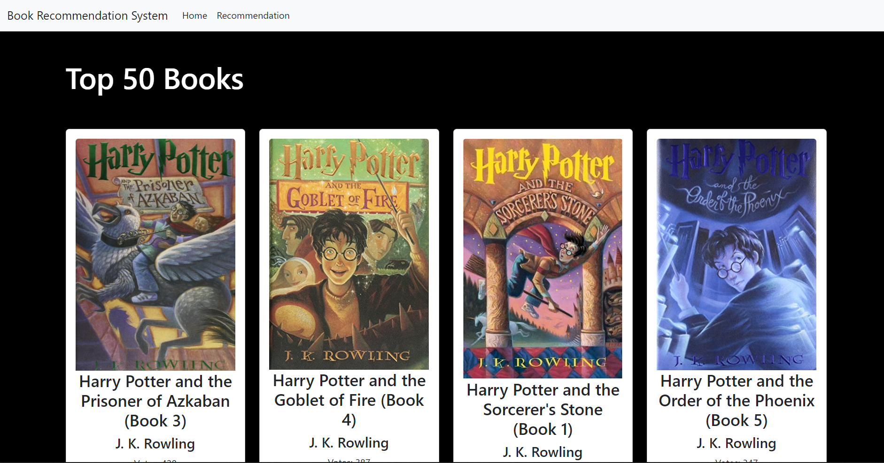
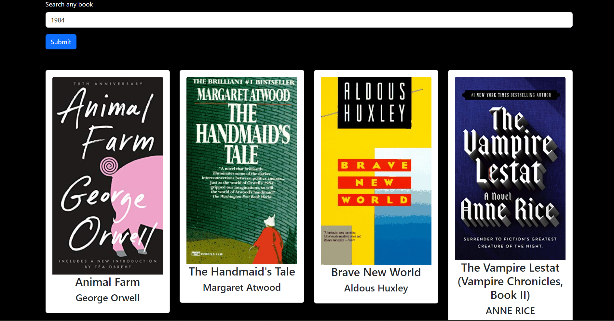

# Project Book Recommendation Syatem

During the last few decades, with the rise of Youtube, Amazon, Netflix and many other such web services, recommender systems have taken more and more place in our lives. From e-commerce (suggest to buyers articles that could interest them) to online advertisement (suggest to users the right contents, matching their preferences), recommender systems are today unavoidable in our daily online journeys.

That's why I choose a recommendation system as my first Machine Learning project. 

The idea is simple: You'll give a book name, and based on that my system will suggest you 5 books which will be almost similar to the book you gave.

---

In a real world, there are 4 types of recommendation systems available: Popularity based, Content based, Collaborative filtering based, and Hybrid recommendation.

    1. Popularity based system: It shows only those contents which are the best or most popular content of a particular paltform. 
        Ex: YouTube Trending page.

    2. Content based system: A Content-Based Recommender works by the data that which is take from the user, either explicitly (rating) or implicitly (clicking on a link). Then that data is used to create a user profile, which is then used to suggest to the user, as the user provides more input or take more actions on the recommendation, the engine becomes more accurate. 
        Ex: YouTube, Google search

    3. Collaborative filtering based system: It works on the basis of how much a particular product has been rated by different users, and later based on those ratings similar to that product or any different products will be shown to users. 
        Ex: Amazon, Flipkart.

    4. Hybrid recommendation system: It is basically a mixture of all the previous three system. What they do is mix all the three concepts, give a particular weightage to each of them and based on the output they show the output to the users. Also the approches here varies from company to company.
        Ex: YouTube, Google search, Netflix, Amazon.. basically any major recommendation system these days works on this one.

---

Here 2 of them are used: Populairy based and collaborative filtering based.

    1. The "Top 50 Books" is based on the populairty based system.

    2. The "Recommendations" is based on the collaborative based system.

---

## Features:
Till now, you have 2 options here: Top 50 Books and Recommendations.

- Top 50 Books:

- Recommendations:

---

Now internally I've set up some algorithms according to which you'll be getting those recommendation and the model is based on batch learning, which means it can only work on the data it has. So if you search for a book which it doesn't have any data about, well, it'll throw you a beautiful error.

After you open the link, go to the "Recommendation" section, to search your book and you'll get our recommendations.

---

You can get the dataset from here: https://www.kaggle.com/datasets/arashnic/book-recommendation-dataset?select=Books.csv

Please give some feedback about what are the things I could have done better or anything you want to say. And thank you!